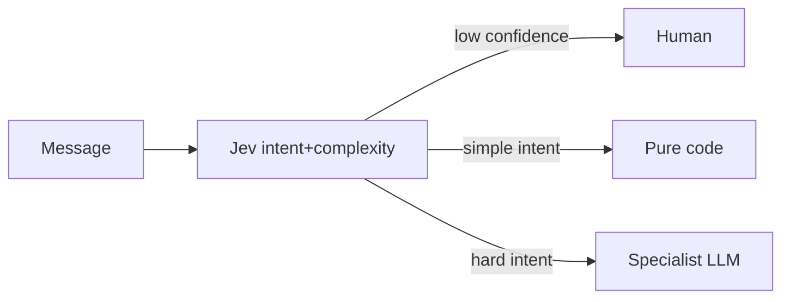

# molten-cascade

**Liquid gold for TypeSafe Jev** — Jev → code → LLM → human.

Pattern 4 from the free Jev cookbooks: System One triages intent + complexity; deterministic code takes the easy branch; a frontier model takes the hard minority; low confidence always escalates.

Siblings: [aurum-gate](https://github.com/Ormus-Solutions/aurum-gate) · [quicksilver-judge](https://github.com/Ormus-Solutions/quicksilver-judge) · [gold-assay](https://github.com/Ormus-Solutions/gold-assay) · [karat-filter](https://github.com/Ormus-Solutions/karat-filter)

## License

MIT (c) Ormus Solutions
